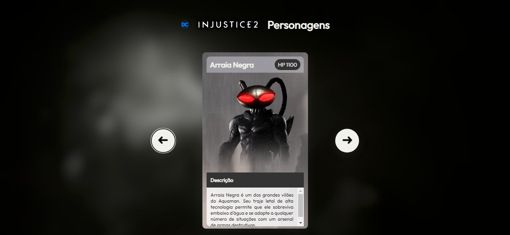

<h2 align="center"> Mapa Dev Week - Carrossel </h2>

Carrossel de cards.

  <a href="#-tecnologias">Tecnologias</a>&nbsp;&nbsp;&nbsp;|&nbsp;&nbsp;&nbsp;
  <a href="#-projeto">Projeto</a>

 

  

### 🚀 Tecnologias

Esse projeto foi desenvolvido com as seguintes tecnologias:

- HTML e CSS
- JavaScript
- Git e Github

### 💻 Projeto

Carrosel de cards de alguns personagens do jogo Injustice 2.

### 🖱️ Visite

https://jonathafernandes.github.io/mapa-dev-week/
